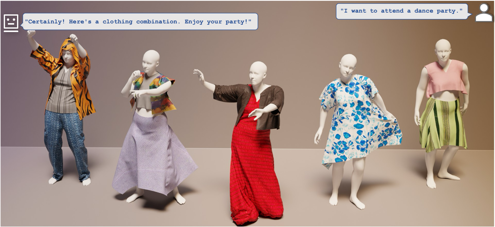

# DressCode: Autoregressively Sewing and Generating Garments from Text Guidance

This repo is the official implementation for _DressCode: Autoregressively Sewing and Generating Garments from Text Guidance_.

**[Kai He](http://academic.hekai.site/), [Kaixin Yao](https://yaokxx.github.io/), [Qixuan Zhang](https://scholar.google.com/citations?user=YvwsqvYAAAAJ), [Jingyi Yu*](http://www.yu-jingyi.com/), [Lingjie Liu*](https://lingjie0206.github.io/), [Lan Xu*](http://xu-lan.com/).** 

**SIGGRAPH 2024 (ACM Transactions on Graphics)**

**[[Project Page]](https://ihe-kaii.github.io/DressCode/) [[Paper Link]](https://arxiv.org/abs/2401.16465.pdf)**



## Abstract

Apparel’s significant role in human appearance underscores the importance of garment digitalization for digital human creation. Recent advances in 3D content creation are pivotal for digital human creation. Nonetheless, garment generation from text guidance is still nascent. We introduce a text-driven 3D garment generation framework, DressCode, which aims to democratize design for novices and offer immense potential in fashion design, virtual try-on, and digital human creation. We first introduce SewingGPT, a GPT-based architecture integrating cross-attention with text-conditioned embedding to generate sewing patterns with text guidance. We then tailor a pre-trained Stable Diffusion to generate tile-based Physically-based Rendering (PBR) textures for the garments. By leveraging a large language model, our framework generates CG-friendly garments through natural language interaction. It also facilitates pattern completion and texture editing, streamlining the design process through user-friendly interaction. This framework fosters innovation by allowing creators to freely experiment with designs and incorporate unique elements into their work. With comprehensive evaluations and comparisons with other state-of-the-art methods, our method showcases superior quality and alignment with input prompts. User studies further validate our high-quality rendering results, highlighting its practical utility and potential in production settings.


## Installation

```shell
git clone git@github.com:IHe-KaiI/DressCode.git
cd DressCode

conda env create -f environment.yaml
conda activate DressCode
```

#### Environmental variable

- Add `./packages` to `PYTHONPATH` for importing custom modules.

#### Local paths setup

Update ```system.json``` with local paths in your system.

- Path to inference output folder (```"output"```)
- Paths for the training dataset
  - Path to sewing pattern dataset (```"datasets_path"```)
  - Path to our captions (```"caption_path"```)
- Paths for simulation of results (leave it empty if no simulation)
  - Path to human model obj (```"human_obj_path"```)
  - Path to simulation temp info file (```"sim_json_path"```)
  - Path to HDR environment map (```"HDR_path"```)
  - Path to local *blender.exe* for rendering (```"blender_path"```)
  - Path to local *mayapy.exe* for simulation (```"maya_path"```)
  - Path to simulation properties (```"dataset_properties_path"```)

#### Download Stable Diffusion 2-1

- Download [Stable Diffusion 2-1](https://huggingface.co/stabilityai/stable-diffusion-2-1-base) to ```./models--stabilityai--stable-diffusion-2-1-base``` for the CLIP embedding module.

#### Packages for Simulation

- To simulate the results, install all dependencies for simulation with [Instructions](./docs/Installation.md).


## Training

#### SewingGPT

- Download the dataset from [[Korosteleva and Lee 2021]](https://github.com/maria-korosteleva/Garment-Pattern-Generator/tree/master) and our [provided captions](https://huggingface.co/IHe-KaiI/DressCode/tree/main). Update Wandb username (```"wandb_username"```) in ```system.json``` if needed.
- Train the model with ```python nn/train.py -c ./models/train.yaml```.
- We use Tensorboard to track the training process with ```tensorboard --logdir=PATH_TO_RECORD_FOLDER```, and our script will save the training records in ```./tensorboard``` by default.

##### Resume your training

Our script will attempt to resume the checkpoint from the latest one in the ```run_id``` folder automatically when the `run_id` is specified in the input config.


#### Prompt for data captioning

- We share our prompt used in GPT-4V for data captioning. Please follow this [instruction](./docs/GPT4V-prompt.md) for details.


## Testing

- Download our pretrained models.

  - Download our [pretrained SewingGPT](https://huggingface.co/IHe-KaiI/DressCode/tree/main/models) to ```./models```.

  - Download our [pretrained PBR texture generator model](https://huggingface.co/IHe-KaiI/DressCode/tree/main/material_gen) to ```./nn/material_gen``` (optional if only testing the SewingGPT).

- Test the SewingGPT with ```python nn/evaluation_scripts/predict_class.py -c ./models/infer.yaml```.

- Test with our UI based on Gradio.

  1. Inference sewing patterns and PBR textures with the pretrained model:
     - Test the model with ```python nn/UI_chat.py```. Input *Shape Prompt* or *Shape Prompt/Texture Prompts* for inference. For example, input prompt ```dress, sleeveless, midi length``` will produce sewing pattern results only; input prompt ```dress, sleeveless, midi length/green velvet``` will produce both sewing patterns and PBR textures. It also supports input multiple garment prompts, with ```;``` (no space) to split, e.g. ``` trouser, long length/green velvet;tank top, cropped length/khaki style  ```.

  2. Simulate and render the predicted results (Simulation is for *Windows* only):
     - Update the local paths in ```system.json```. You may need to use the full paths to the inference output folder (```"output"```) and HDR map (```"HDR_path"```) for Blender rendering.
     - Test the model with simulation using our UI by ```python nn/UI_chat.py --sim```. The same rule applies to prompts as in Step 1.

  3. Use ChatGPT as an LLM interpreter for interactively customized garment generation:

     - Update the ```"OpenAI_API_Key"``` and ```"https_proxy"``` (if needed) in ```system.json```.

     - Test the model using our UI with ```python nn/UI_chat.py --sim --GPT```. This time, users can chat with agents and provide their preferences, e.g. ```I want to attend a party.```

- Our results also support users in loading generated meshes and textures to 3D clothing design software (e.g. Marvelous Designer) for subsequent simulation and animation.


#### Visualize 3D sewing patterns

- Our script can visualize multiple 3D sewing patterns (before stitching) and output a combined 3D mesh with ```python nn/multiple_patterns_vis.py --folder PATH_TO_FOLDER```. The output will be in the same folder as the input folder.


## Acknowledgment

This project is built upon [NeuralTailor](https://github.com/maria-korosteleva/Garment-Pattern-Estimation). Some codes for basic operations on sewing patterns are adopted from [Sewformer](https://github.com/sail-sg/sewformer). Our dataset is based on [[Korosteleva and Lee 2021]](https://github.com/maria-korosteleva/Garment-Pattern-Generator/tree/master). We thank all the authors for their impressive repos.


## Citation

If you use this dataset for your research, please cite our paper:

```
@article{he2024dresscode,
  title={DressCode: Autoregressively Sewing and Generating Garments from Text Guidance},
  author={He, Kai and Yao, Kaixin and Zhang, Qixuan and Yu, Jingyi and Liu, Lingjie and Xu, Lan},
  journal={ACM Transactions on Graphics (TOG)},
  volume={43},
  number={4},
  pages={1--13},
  year={2024},
  publisher={ACM New York, NY, USA}
}
```


